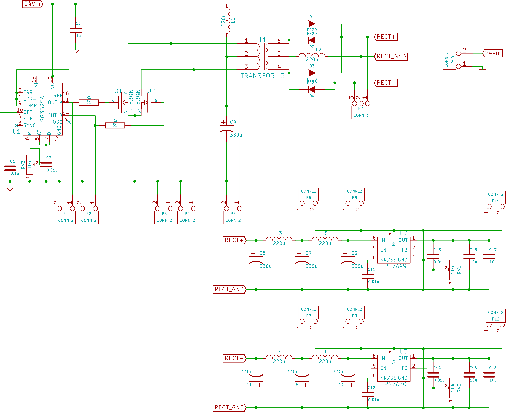

# Parts Selection
1. Input buffer

    AD8421BR

2. Variable gain

    LMH6505

3. Integrator Op-Amp

    OPA827AID

4. P & D Op-Amp

    AD8067

5. Output Buffer & Feed Forward

    LM7171BIM

6. Analog Switches

    1. Normal Close

        DG467

    2. Normal Open

        DG468

    3. SPDT

        DG469

7. Power Supply

    1. AC-DC

        KPS5-5

    2. DC-DC

        * RB-0505D
        * RB-0512D
        * RB-0515S

8. Connectors

    1. Ribbon Cable

        * 302-S101
        * 101-106

    2. SMA

        1814832

9. Potentiometers

    84WR*LF

10. Resistors

    RMCF0603FT*

11. Capacitors

    1. Small

        C1206C*

    2. Big

        UWT1E331MNL1GS (330uF, 25V)

12. High Frequency Transformers

    7603900*

13. PWM Driver

    SG3525A

14. Low Noise Linear Low Dropout(LDO) Voltage Regulator

    1. Negative

        TPS7A30

    2. Positive

        TPS7A49

15. Inductors

    SRN1060

# Specifications

Part Number|Power|Input|Output|Packaging
-----------|-----|-----|------|---------
AD8421BR|±2.5V ~ ±18V (2mA)|(V-)+2.3V ~ (V+)-1.8V|(V-)+1.2V ~ (V+)-1.6V|8-MSOP / 8-SOIC
LMH6505|±3.5V ~ ±6V (2μA)|±7mA / ±0.6V|±2.4V~±3V|8-MSOP / 8-SOIC
OPA827AID|±4V ~ ±18V (6mA)|(V-)+3 ~ (V+)-3|(V-)+3 ~ (V+)-3|8-MSOP / 8-SOIC
AD8067|±2.5V ~ ±12V (7mA)|-12V ~ 9V (For ±12V) | ±11.7V (For ±12V)|SOT23-5
LM7171BIM|±2.75V ~ ±18V (7mA)|±10V (?)|±10V (For ±15V)|8-SOIC
DG467/DG468|±4.5V ~ ±20V (20μA)|||6-TSOP
DG469|±4.5V ~ ±15V (3μA)|||8-MSOP / 8-SOIC
SG3525A|8V ~ 35V (±400mA Peak)|||16L-SOIC
TPS7A30||3V ~ 35V|1.19V ~ 33V (150mA)|8-MSOP PowerPad
TPS7A49||-3V ~ - 35V|-1.18 ~ -33V (200mA)|8-MSOP PowerPad

# Power Supply Board
](power/power.png)

# Op-Amp Test Board
](test-op/test-op.png)

# Power Supply Test Board
](test-power/test-power.png)
